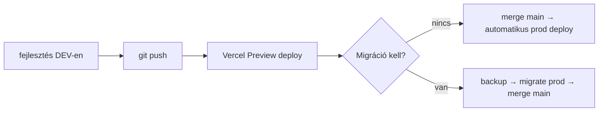

# Creatorz.hu — Élesítési gyors-útmutató

Ez egy **tömör, lépésről-lépésre** segédlet, hogy

1. **élesíteni** tudd az oldalt;
2. **frissítéseket fel tudj rakni anélkül, hogy elvesznének a felhasználók és a hirdetések**;
3. bármikor **biztonsági mentést** készíts az adatbázisról.

> A részletes, hosszú változat: `LAUNCH.md`. Ez itt a „cheat sheet".

---

## 0. A legfontosabb dolog, amit érts meg

A **kód** és az **adat** két külön dolog:

- A **kód** a GitHub-on van, és a **Vercel** futtatja. Új verzió felmásolása csak a kódot cseréli — felhasználók, hirdetések, üzenetek **nem érintettek**.
- Az **adatok** a **Supabase** Postgres adatbázisban élnek, a kódtól függetlenül.

**Egyetlen veszély:** ha az adatbázis-séma (oszlopok, táblák) hibásan változik. Ezt szabályozott migrációkkal és backup-pal kezeljük (lásd 4–5).

---

## 1. Egyszeri élesítés (csak a legelső deploy)

1. **Supabase Pro** előfizetés (cca. $25/hó) — fontos, mert csak így kapsz napi auto-backup-ot és PITR-t (point-in-time recovery).
2. Két Supabase projekt:
   - `creatorz-prod` — éles
   - `creatorz-dev` — fejlesztéshez
3. Vercel projekt — Next.js — minden Production env-változó beállítva (lásd `LAUNCH.md` 8. fejezet).
4. Domain (`creatorz.hu`) → Vercel-re mutat.
5. Stripe Live mode + live webhook → `https://creatorz.hu/api/webhooks/stripe`.
6. Resend → domain verifikálva (SPF + DKIM DNS rekordok).
7. **Supabase email template-ek átírása** — másold be ezeket:
   - Authentication → Email Templates → **Reset Password** body: futtasd `node` REPL-ben:
     ```js
     import("./lib/email/templates.js").then((m) =>
       console.log(m.renderPasswordResetEmailForSupabase())
     );
     ```
     (vagy a böngészőből az ÁSZF-stílusú branded layout — a `lib/email/templates.ts` `renderPasswordResetEmailForSupabase()` függvény adja vissza).
   - Confirm signup → `renderSupabaseConfirmEmail()` kimenete.
8. Migráció futtatás üres prod DB-re:
   ```bash
   DATABASE_URL="<PROD_POOLER>" npm run db:migrate
   ```
9. Első admin létrehozása (regisztráció után):
   ```sql
   update users
   set role = 'admin', approved = true, email_verified = true
   where email = '<ADMIN_EMAIL>';
   ```

---

## 2. Frissítések felmásolása (a hétköznapi menet)



### 2.1. Csak kód-változás (új komponens, fix, design)

1. Helyi fejlesztés → `npm run dev` (DEV Supabase).
2. `git push` → Vercel Preview URL-en megnyitod, kipróbálod.
3. Ha jó: merge a `main`-be → **Vercel automatikusan kirakja élesre**.
4. Felhasználók és hirdetések nem érintettek. ✅

### 2.2. Adatbázis-séma változás (új mező, új tábla)

1. `lib/db/schema.ts` szerkesztése.
2. `npm run db:generate` → új SQL migráció a `lib/db/migrations/` mappába.
3. DEV-en próba: `DATABASE_URL="<DEV>" npm run db:migrate`.
4. Kódot leteszteled DEV-en.
5. **Backup PROD-ról** (lásd 3. fejezet) — mindig, kötelezően.
6. `DATABASE_URL="<PROD>" npm run db:migrate` — futtatja az új migrációt.
7. Merge a `main`-be → kód kimegy a már felkészített sémához.

> A `db:migrate` parancs **csak az ÚJ, még nem alkalmazott** migrációkat futtatja. A korábban futott migrációkat egy táblában nyilvántartja (`__drizzle_migrations`). Tehát ha a 0000–0002 már fut a prod-on, és most a 0003-at adod hozzá, csak az fut le.

### 2.3. Soha NE tedd PROD-on:

- `DROP TABLE`, `DROP COLUMN`, oszlop átnevezése egy lépésben.
- Az oszlop NULL → NOT NULL kényszer ráhúzása, ha vannak NULL értékek.
- `npm run db:push` (ez a séma-szinkronizáló — fejlesztésre való, prod-ot felülírhat).

**Mit tegyél helyette:** „bővít → adatot áttölt → régit eldob" 3 lépésben:
1. Új oszlop NULLABLE-ként hozzáadása.
2. Adat áttöltése script-tel.
3. Régi oszlop eldobása **csak miután** a kód már nem hivatkozik rá.

---

## 3. Biztonsági mentés készítése (manuális, bármikor)

### 3.1. Admin felületen (a leggyorsabb)

1. Lépj be admin-ként → **Áttekintés**.
2. „Biztonsági mentés" kártya → **„Mentés letöltése"**.
3. A letöltött `creatorz-backup-YYYY-MM-DD.json` egy teljes pillanatkép minden táblából (`users`, `creator_profiles`, `brand_profiles`, `ads`, `messages`, `subscriptions`, …).
4. Tárold biztonságosan — pl. titkosított felhőtárhely, USB.

### 3.2. Supabase Dashboard backup (igazi disaster-recovery)

- Supabase Pro automatikusan napi backup-ot készít (utolsó 7 napra).
- **PITR (Point-in-Time Recovery)**: bármely másodpercre visszaállítható az utolsó 7 napban.
- Eléred: Supabase project → Database → Backups → „Restore".

### 3.3. Mikor csinálj backup-ot?

- **Minden séma-migráció előtt** (kötelező).
- Nagyobb deploy előtt (ha új feature-t adsz).
- Havonta egyszer, archív célra.

---

## 4. Mi történik, ha valami elromlik?

| Probléma | Megoldás |
|---|---|
| Új deploy lerontja az UI-t | Vercel → Deployments → korábbi → **„Promote to Production"** (1 kattintás, adat nem érintett). |
| Migráció hibázik | Supabase → Database → Backups → **PITR a hiba ELŐTTI időre** visszaállítás. |
| Hirdetés / user „eltűnt" | Az admin felületen leszűröd (törlés-jelölt nincs); ha tényleg törölve van, PITR-rel visszaállítható. |
| Stripe nem ad fizetést | Stripe Dashboard → Webhooks → log megnézése. Általában env-változó hiba. |

---

## 5. Élesítés előtti checklist (kötelező)

- [ ] `https://creatorz.hu` betölt, HTTPS zöld lakat.
- [ ] Regisztráció → megerősítő email megérkezik (Resend log).
- [ ] Jelszó-emlékeztető működik (Supabase template átírva).
- [ ] Bejelentkezés (creator + brand + admin) OK.
- [ ] Új profil képpel + portfólióval menthető.
- [ ] Hirdetés feladása → admin jóváhagyás → publikus.
- [ ] Stripe Live vásárlás (saját kártyával 1 ciklust ki tudsz próbálni, majd visszamondod).
- [ ] Cron-ok futnak: Vercel → Settings → Cron Jobs.
- [ ] Sitemap + robots.txt elérhető.
- [ ] Admin → Biztonsági mentés → letöltés tesztelése.
- [ ] Mobil nézet (iPhone + Android) a fő oldalakon.

---

## 6. A te első napi rutinod élesítés után

1. **Hétfő reggel:** admin → Biztonsági mentés letöltés.
2. **Új feature:** branch → DEV → Preview → merge.
3. **Új migráció:** backup → migrate → merge.
4. **Heti egyszer:** ellenőrizd a Supabase tárhely-használatát, a Stripe bevételeket, a Vercel build-eket.

---

> Részletes táblázatok, env-változó listák, DNS-bejegyzések:
> `LAUNCH.md` (teljes verzió) és `DEPLOY.md` (régi, projekt-specifikus).
